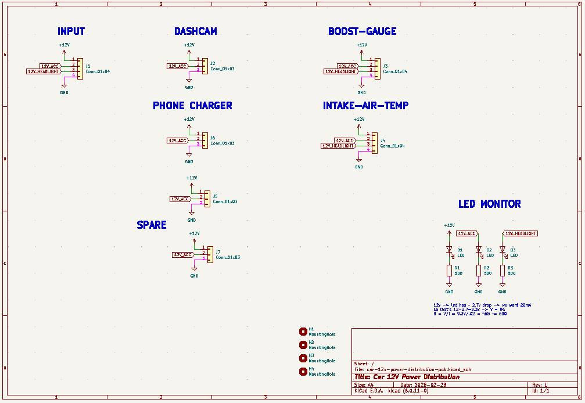
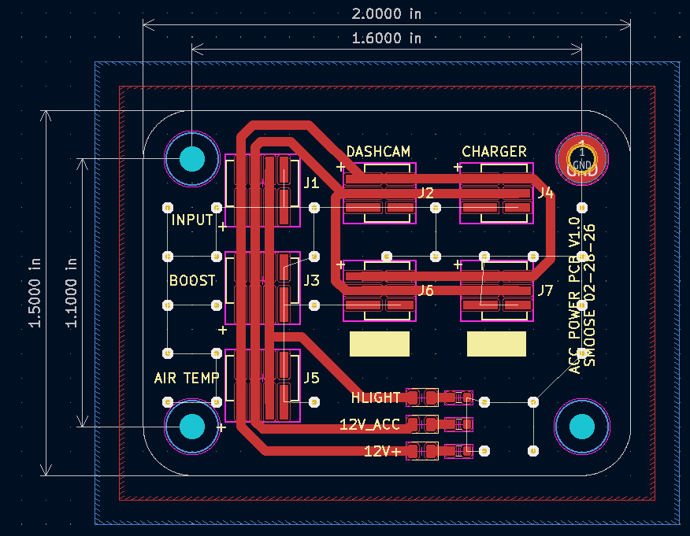
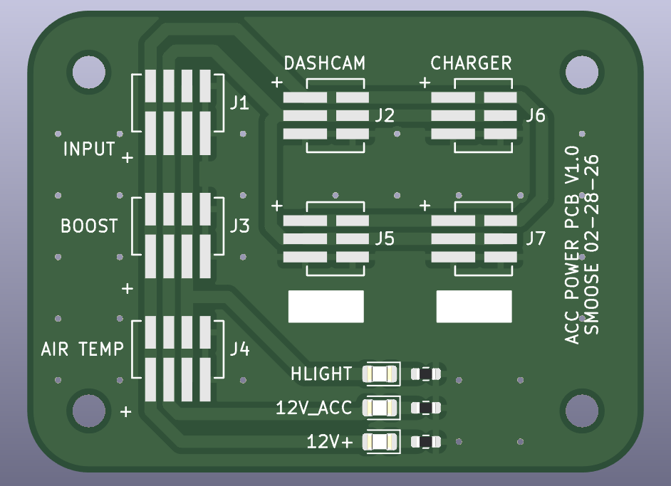

# Car 12V Power Distribution PCB
12V distribution block for supporting interior automotive (12V+) accessories. Note: Some accesories mentioned such as dashcam and charger have downstream 5V regulators. Molex PicoSpox contacts (0874370231) are rated for 3A each with 24AWG wire.

## Notes
- Footprints are Molex PicoSpoX-style SMD 1.5mm pitch footprints. 
- Inputs:
  - `12V+` (+12V battery)
  - `12V_ACC` (+12V accessory)
  - `GND` (ground)
- Output (3-pin): `+12V_BATT`, `+12V_ACC`, `GND`
- Output (4-pin): `+12V_BATT`, `+12V_ACC`, `+12V_HEADLIGHT`, `GND`
- PCB uses 40 mil traces for all nets. 
- Board outline is 1.5" x 2".
- 3D printed caddy will require strain relief and a mobile loop of wire to move with the opening/closing of the drawer.

## Schematic

## PCB Layout

## 3D Model

## BOM
- 3-pin connector [Molex #0874370363](https://www.digikey.com/en/products/detail/molex/0874370363/2834835)
- 4-pin connector [Molex 0874370473](https://www.digikey.com/en/products/detail/molex/0874370473/2421923)

Mating connectors (cable-side):
- 3-pin housing [Molex #0874370363](https://www.digikey.com/en/products/detail/molex/0874370363/2834835)
- 4-pin housing [Molex #0874370473](https://www.digikey.com/en/products/detail/molex/0874370473/2421923)
- Molex PicoSpox Contact [Molex #0874210000](https://www.digikey.com/en/products/detail/molex/0874210000/561764)

## Reference
- [Molex PicoSpox Wire-to-Board Connectors](https://www.digikey.com/en/product-highlight/m/molex-connector/pico-spox-wire-to-board-connector-system)